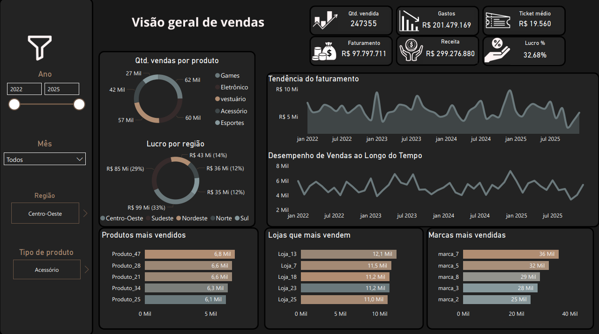

# 📊 Dashboard de Vendas — Power BI

Este projeto apresenta uma análise completa de vendas utilizando **Power BI** e **Excel** como base de dados.  
A solução consolida informações de produtos, lojas e transações, permitindo uma visão ampla do desempenho comercial ao longo dos anos.

O resultado é um dashboard interativo, moderno e intuitivo, que oferece KPIs estratégicos e insights essenciais para tomada de decisão.

## 🔗 Acesse o Dashboard

**Dashboard disponível em:** [Clique aqui para visualizar](https://app.powerbi.com/view?r=eyJrIjoiMzg5MGM2OGMtY2NhMy00MWFhLWE4YzctMGJkNTdjZTVhNDk0IiwidCI6ImUyZjc3ZDAwLTAxNjMtNGNmNi05MmIwLTQ4NGJhZmY5ZGY3ZCJ9)

---

## Dashboard Overview

## 🗂️ Estrutura dos Dados

Foram utilizadas **3 tabelas**:

### **1. Produtos**
Contém informações de cada item vendido:
- `produto_id`
- `nome_produto`
- `marca`
- `tipo_produto` (Esportes, Games, Eletrônico, Vestuário…)
- `preco_compra`
- `preco_venda_sugerido`

---

### **2. Lojas**
Dados das unidades de venda:
- `loja_id`
- `nome_loja`
- `regiao` (Norte, Nordeste, Centro-Oeste, Sudeste, Sul)

---

### **3. Transações**
Registra todas as vendas:
- `transacao_id`
- `produto_id` (chave)
- `loja_id` (chave)
- `data_transacao`
- `tipo_transacao`
- `quantidade`
- `desconto`
- `metodo_pagamento`
- `custo_transporte`

---

## 🧮 Medidas DAX Criadas

Para construção do dashboard foram desenvolvidas métricas em DAX, como:

- **Qtd. Vendida**
- **Faturamento**
- **Receita**
- **Gastos**
- **Lucro**
- **Lucro %**
- **Ticket Médio**
- **Quantidade Vendida por Produto / Loja / Marca**
- **Descontos e custos logísticos agregados**
- **Tendência de faturamento ao longo dos anos**

## 📊 Visão Geral do Dashboard

A interface foi projetada com foco em clareza, cores discretas e visualização moderna.  
O dashboard oferece uma visão completa da operação:

### **KPIs Principais (EX: Para 2022-25 )**

- Para 2022-25 :
- **Qtd. vendida:** 247.355  
- **Faturamento:** R$ 97.797.711  
- **Receita:** R$ 299.276.880  
- **Gastos:** R$ 201.479.169  
- **Ticket médio:** R$ 19.560  
- **Lucro %:** 32,68%

---

## 📈 Principais Visualizações

### **1. Quantidade de vendas por produto**
Um gráfico de rosca comparando categorias como:
- Games  
- Eletrônico  
- Vestuário  
- Acessório  
- Esportes  

### **2. Lucro por região**
Mostra a participação percentual e o valor total do lucro em cada região:
- Centro-Oeste  
- Sudeste  
- Nordeste  
- Norte  
- Sul  

### **3. Tendência do faturamento ao longo do tempo**
Curva temporal exibindo meses de maior pico de vendas.

### **4. Desempenho de vendas ao longo do tempo**
Série temporal focada na quantidade vendida mensalmente.

### **5. Produtos mais vendidos**
Top 5 produtos com maior volume de vendas.

### **6. Lojas que mais vendem**
Ranking das unidades com maior desempenho.

### **7. Marcas mais vendidas**
Destaque para as marcas com maior relevância no faturamento.

---

## 🎛️ Filtros do Dashboard

O usuário pode interagir com:

- **Ano (2022 a 2025)**  
- **Mês**  
- **Região**  
- **Tipo de produto**  

Esses filtros permitem análises exploratórias profundas e segmentação granular das vendas.

---

## 🔍 Insights Obtidos

A análise revelou diversos pontos estratégicos:

### ✔ **1. Desempenho por categoria**
Produtos de Games e Eletrônicos apresentam maior volume de vendas.

### ✔ **2. Região mais lucrativa**
O **Centro-Oeste** e o **Sudeste** lideram em lucro total.

### ✔ **3. Grandes picos de faturamento**
Alguns meses entre 2023 e 2024 registraram aumentos expressivos.

### ✔ **4. Marcas dominantes**
marcas como **marca_7**, **marca_5** e **marca_8** se destacam como líderes.

### ✔ **5. Lojas mais fortes**
Unidades como **Loja_13**, **Loja_7** e **Loja_18** apresentam alto potencial de crescimento.

---

## 🛠️ Ferramentas Utilizadas

- **Excel**: limpeza e organização das três tabelas.  
- **Power BI Desktop**:  
  - modelagem  
  - medidas DAX  
  - construção do dashboard  
  - design e layout visual  

